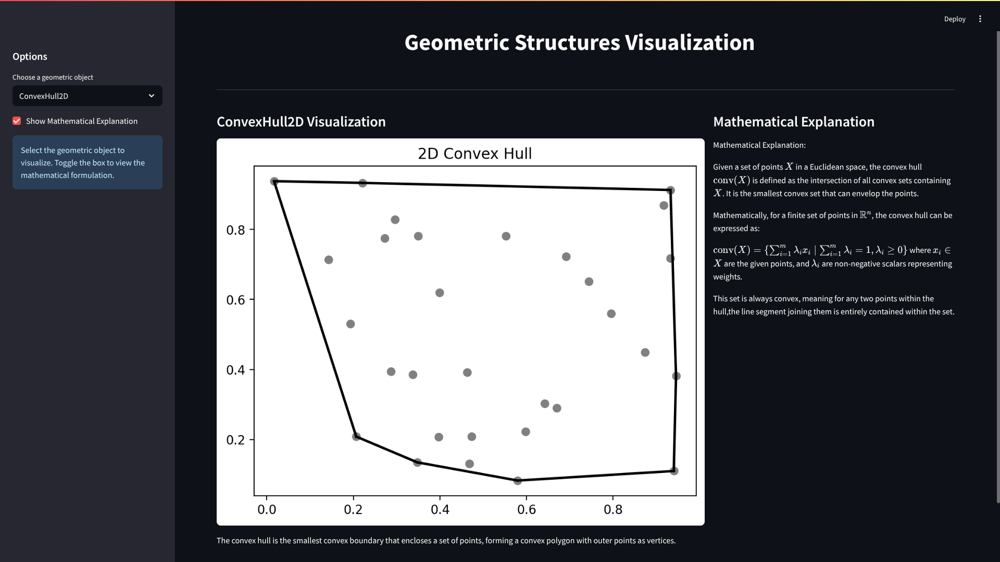

# mathVis

**mathVis** is a Streamlit-powered educational app for exploring and visually understanding fundamental geometrical objects from linear and discrete optimization, such as convex hulls, polyhedra, and cones.  
The app gives **graphical representations, intuitive descriptions, and mathematical explanations** for each object.

---

## Features

- Interactive selection of geometric objects: Convex Hull, Conical Hull, Convex Cone, Polytope, Polyhedral Cone, and more.
- Visualization of each object using Matplotlib.
- Clear descriptions and mathematical (LaTeX-formatted) explanations.
- Powered by Streamlit for instant web-based interactivity.
- Modular code: Easily add new objects as Python modules in the `graphs/` folder.

---

## Demo

 <!-- Optional: Add a screenshot in your repo for better appeal -->

---

## Geometric Structures: Comparison Table

| Structure        | Convex? | Bounded?     | Generators            | Description                                               |
|------------------|---------|--------------|-----------------------|-----------------------------------------------------------|
| **Convex Hull**      | Yes     | Yes (if finite set) | Points                | Smallest convex set containing a given set of points.     |
| **Conical Hull**     | Yes     | No           | Vectors (finite set)  | All non-negative combinations of given vectors.           |
| **Convex Cone**      | Yes     | No (except $\\{0\\}$) | Directions/rays (possibly infinite) | Any set closed under non-negative scaling/addition.       |
| **Polyhedral Cone**  | Yes     | No (except $\\{0\\}$) | Vectors (finite set)  | Convex cone defined by finitely many linear inequalities. |
| **Polyhedron**       | Yes     | Not always   | Faces/vertices/edges  | Solution set to finitely many linear inequalities.        |
| **Polytope**         | Yes     | Yes          | Vertices (finite set) | Bounded polyhedron; convex hull of a finite set of points.|

---


## Getting Started

### Prerequisites

- Python 3.8+
- [pip](https://pip.pypa.io/en/stable/installation/)

### Installation

Clone this repository:
```bash
git clone https://github.com/IhebDridi/mathVis.git
cd mathVis
```

Install dependencies:
```bash
pip install -r requirements.txt
```

### Run Locally

```bash
streamlit run MainStreamLit.py
```

Your web browser will open automatically. Use the sidebar to select a geometric object and view its visualization, description, and mathematical explanation.

---

## Folder Structure

```
mathVis/
│
├── MainStreamLit.py          # Main Streamlit app
├── graphs/                   # Individual Python modules for each graph type
│    ├── ConvexHull2D.py
│    ├── Polytope.py
│    └── ...
├── requirements.txt
├── README.md
```

---

## Add New Graph Types

1. Create a new Python file in `graphs/`, e.g., `MyPolyhedron.py`.
2. Define a function `plot_mypolyhedron` that returns `(fig, description, math_explanation)`.
3. The app will automatically load new graph types at startup!

---

## Deploy on Streamlit Community Cloud

- Push your repo to GitHub.
- Go to [https://streamlit.io/cloud](https://streamlit.io/cloud).
- Link your repo and deploy.  
- **Updates auto-deploy** when you push new changes.

See [the official docs](https://docs.streamlit.io/streamlit-community-cloud/) for more details.

---

## Credits

- Built with [Streamlit](https://streamlit.io/)
- Mathematical algorithms from [scipy](https://scipy.org/) and [numpy](https://numpy.org/)
- Visualization by [matplotlib](https://matplotlib.org/)

---

## License

MIT License

---

## Contributing

Open an issue or pull request to suggest new geometries, fix bugs, or add documentation!

---


## Live Demo

:rocket: **Try the app online:**  
[https://mathvis-8fot3lo7zuzehveqhsrdld.streamlit.app/](https://mathvis-8fot3lo7zuzehveqhsrdld.streamlit.app/)

---

**Enjoy visualizing mathematics!**